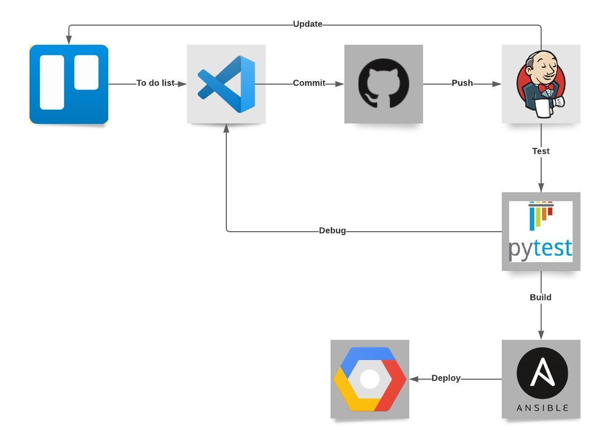

# Learn Spanish app
The function of this app is to facilitate learning of Spanish vocabulary. It generates Spanish words that are displayed to the user with some additional information. Every time a word is learned (displayed for the first time) or reviewed (displayed again), this activity is recorded. This can be used to let the user know when they should review next (sooner if it's a new word, later if it's a known word). This idea is based on Spaced repetition systems for language learning.


# Design

## Brief
This app was created as part of DevOps Core Practical Project during a QA DevOps bootcamp in February 2021. The project aimed to create and deploy four interconnected services using the following technologies:

* Kanban Board: Asana or an equivalent Kanban Board
* Version Control: Git
* CI Server: Jenkins
* Configuration Management: Ansible
* Cloud server: GCP virtual machines
* Containerisation: Docker
* Orchestration Tool: Docker Swarm
* Reverse Proxy: NGINX

Services #2, #3, #4 were required to generate objects have two different implementations each to demonstrate swapping these implementations out without disruption.

## Services design

### Service #1

Service #1 pulls all services together by sending requests to services #2, #3 and #4 and generating a html temple which displays all the objects together. 

If implementation A is deployed, service #1 displays a random word in Spanish, and example of usage and the date when the word was last reviewed by the user. It forwards the generated word to services #3 and #4.

If implementation B is deployed, it displays a random word in English, its Spanish translation and the recommended review date.

Service #1 also adds the Spanish word and today's date to the Review table in the database.

### Service #2
* Implementation A: generates a random word in Spanish from a database and sends it to Service #1
* Implementation B: generates a random word in English

### Service #3
* Implementation A: generates a random sentence in Spanish which includes the word generated in service #2. The sentences are pulled from the database.

* Implementation B: generates a Spanish translation of the English word generated by service #2.

### Service #4
* Implementation A: checks the Review table of the database for records corresponding to the word generated by service #2. If there are no records, it generates the response 'New word'. Otherwise, it produces the most recent review date.

* Implementation B: checks the Review table of the database for records corresponding to the word generated by service #2. It then generates a recommendation on when to review the word next to aid memorisation. The recommendation is based on how many times the word has been seen by the user, and can be two days, 7 days, 14 days or 30 days.

## Database 
I used a managed GCP Mysql instance which I prepopulated with data (words and sentences with translations). I used a managed database because I found it easier to set up to persist data between builds. Other advantages include better stability and backups. 


The design could be improved by normalising the data. For instance, the review table should reference words' id rather than the words themselves. Due to the time constraints of the project I decided to focus on the essential aspects as this issue does not affect the functionality of the app.

## Virtual machines

* Jenkins VM - used to deploy the Jenkins pipeline
* Swarm manager VM
* Swarm worker VM
* Nginx - Load balancer for the swarm


# Project management

## Workflow
A Trello board was the main project management tool used. The board developed along with the project as my knowledge increased. I was able to decompose each story into smaller tasks. I updated the board daily. Several times it became clear that what I initially thought was essential was not as important - and vice versa, so I adjusted the plan accordingly.

<figure>

<figcaption> Early version of the board with user stories. </figcaption>
</figure>


## CI Pipeline



The webhook ensures that new pushes to GitHub triggers a new build in Jenkins. A pipeline is started based on the Jenkinsfile in the Github repo. In the next step the code is tested with pytest. Next, the Ansible playbook is launched in the pipeline. Ansible provisions the environment of the VMs, builds app images, and deploys them to a swarm stack, based on a docker-compose file.

## Risk assessment


During the project I learned that I underestimated the risks arising from possible version control issues. This project was challenging in this sense because it required the update to be merged into the base application without conflicts. Ideally, the base application should be completed first before the update, but at times I had to work on both simultaneously which complicated the versioning and produced conflicts. It made me more aware of the need to follow the best practices and plan ahead.

# Development

## Data pre-processing
The app required a database of Spanish words and sentences with English translation. Vocabulary list and translations were obtained from NCELP (2019). *Full list: words within the 2000 most frequent in Spanish without entries in AQA GCSE Spanish vocabulary specification (by word class)*. National Centre for Excellence for Language Pedagogy: University of York, UK. The list is available under CC BY-NC-SA 4.0. The sentences with translations come from Tatoeba, https://tatoeba.org, released under CC-BY 2.0 FR. Tatoeba contains sentences in 392 languages.

The vocabulary was available in a table within one .doc file.

Tatoeba sentences are available in separate csv or tsv files for each language. Each sentence for each language has a unique id. To create a table with English and Spanish versions of the same sentences they had to be linked using another table provided (Links) which provides links between ids to associate sentences with their translations in all 397 languages.

I converted all files into lists of lists in Python and used SqlAlchemy to to upload the data into separate tables. This was quite a slow process as the lists contained hundreds of thousands of sentences and many millions of links between them. Here I will talk about an alternative. Finally, I used joins in SQL to find sentences that existed in both English and Spanish and link them together. The pre-processing scripts are available in the following files: .

## Python code for four services

Some issues included:

* When combining the services to work together I encountered frequent errors whenever the generated word contained special characters. This was an encoding issue which I resolved by decoding in 'latin-1'.

## Unit testing

Some things that needed to be tested were:
* can each app be loaded succesfully?
* does generating an object in each service produce the expected output?

Unit testing presented quite a challenge. Each service makes use of the managed database but I wanted to test them separately, so that the failure of the database woudn't automatically cause the tests to fail. Connecting to the database was not an option. This presented a couple of issues. 

* The functions had to be run against something else. 
* I needed to import the app, which then tried to connect to the database and failed. 

To simulate the database I decided to build a mock database with sqllite and populate it in the set up with some sample data. This wasn't quite ideal because it didn't exactly replicate the database, but it allowed me to check if the applications worked for selected cases. For example, when checking service #4 implementation B, I could see if the output is correct for words which appear in the table once, twice or not at all.

This allowed me to test against a mockdatabase. One feature still missing is testing whether data added inside service #1 is actually being added to the database so this will need to be added.


Testing is included in the Jenkins pipeline so it is rerun with every build. Here are the results for each service test with coverage:


## Environment provisioning and deployment

The environmental provisioning and deployment were both carried out inside an Ansible Playbook. I decided to try doing all the deployment activities to streamline it by using the Ansible modules. I divided the tasks between the following roles for clarity:

* docker - installs docker on all VMs
* swarm-init - initiates a swarm on the manager VM
* swarm-join - adds the worker vm to the swarm
* webserver - installs and configure nginx on the load balancing VM
* image-build - builds and exports images to Docker hub for use in the docker stack
* docker-stack - deploys the stack with 3 replicas per service

One disadvantage of my approach was that the Jenkins machine, which was used to run the deployment on, had to be set up manually. This makes the app less portable. The builds also take more time because each time Ansible has to check that the environment is up to the specification. However, I thought that Ansible worked pretty well for the deployment. I think that a better approach would be to use two Ansible playbooks: one to provision the environment for all machines, including the Jenkins VM; and another one for deployment.

```[project-2] $ ansible-playbook ./playbook.yaml -i ./inventory.yaml -b --become-user root

PLAY [all] *********************************************************************

TASK [Gathering Facts] *********************************************************
ok: [34.82.117.37]
ok: [35.247.22.119]
ok: [35.199.180.194]
ok: [10.138.0.29]

TASK [docker : install dependencies] *******************************************
ok: [35.247.22.119]
ok: [34.82.117.37]
ok: [35.199.180.194]
ok: [10.138.0.29]

TASK [docker : get the docker apt] *********************************************
ok: [35.247.22.119]
ok: [35.199.180.194]
ok: [34.82.117.37]
ok: [10.138.0.29]

TASK [docker : add the apt repo] ***********************************************
ok: [34.82.117.37]
ok: [35.247.22.119]
ok: [35.199.180.194]
ok: [10.138.0.29]

TASK [docker : install docker-ce] **********************************************
ok: [35.247.22.119]
ok: [34.82.117.37]
ok: [35.199.180.194]
ok: [10.138.0.29]

TASK [docker : Docker is started] **********************************************
ok: [35.199.180.194]
ok: [35.247.22.119]
ok: [34.82.117.37]
ok: [10.138.0.29]

TASK [docker : Install Dockers pip package] ************************************
ok: [35.247.22.119]
ok: [35.199.180.194]
ok: [34.82.117.37]
ok: [10.138.0.29]

TASK [docker : adding julia user to docker group] ******************************
ok: [35.199.180.194]
ok: [35.247.22.119]
ok: [34.82.117.37]
ok: [10.138.0.29]

TASK [docker : adding ubuntu user to docker group] *****************************
ok: [35.247.22.119]
ok: [34.82.117.37]
ok: [35.199.180.194]
ok: [10.138.0.29]

PLAY [manager] *****************************************************************

TASK [Gathering Facts] *********************************************************
ok: [35.247.22.119]

TASK [swarm-init : Init a new swarm with default parameters] *******************
ok: [35.247.22.119]

TASK [swarm-init : pass on join_token] *****************************************
ok: [35.247.22.119]

PLAY [worker] ******************************************************************

TASK [Gathering Facts] *********************************************************
ok: [35.199.180.194]

TASK [swarm-join : Add nodes] **************************************************
ok: [35.199.180.194]

PLAY [nginx] *******************************************************************

TASK [Gathering Facts] *********************************************************
ok: [34.82.117.37]

TASK [webserver : Install NGINX] ***********************************************
ok: [34.82.117.37]

TASK [webserver : Add nginx conf] **********************************************
ok: [34.82.117.37]

TASK [webserver : Start NGINX Service] *****************************************
ok: [34.82.117.37]

PLAY [jenkins] *****************************************************************

TASK [Gathering Facts] *********************************************************
ok: [10.138.0.29]

TASK [image-build : Log into DockerHub] ****************************************
ok: [10.138.0.29]

TASK [image-build : Build an image for service 1 and push it to a repo] ********
[WARNING]: The default for build.pull is currently 'yes', but will be changed
to 'no' in Ansible 2.12. Please set build.pull explicitly to the value you
need.
changed: [10.138.0.29]

TASK [image-build : Build an image for service 2 and push it to a repo] ********
changed: [10.138.0.29]

TASK [image-build : Build an image for service 3 and push it to a repo] ********
changed: [10.138.0.29]

TASK [image-build : Build an image for service 4 and push it to a repo] ********
changed: [10.138.0.29]

PLAY [manager] *****************************************************************

TASK [Gathering Facts] *********************************************************
ok: [35.247.22.119]

TASK [docker-stack : pip] ******************************************************
ok: [35.247.22.119]

TASK [docker-stack : Copy compose file] ****************************************
ok: [35.247.22.119]

TASK [docker-stack : Deploy stack from a compose file] *************************
changed: [35.247.22.119]

PLAY RECAP *********************************************************************
10.138.0.29                : ok=15   changed=4    unreachable=0    failed=0    skipped=0    rescued=0    ignored=0   
34.82.117.37               : ok=13   changed=0    unreachable=0    failed=0    skipped=0    rescued=0    ignored=0   
35.199.180.194             : ok=11   changed=0    unreachable=0    failed=0    skipped=0    rescued=0    ignored=0   
35.247.22.119              : ok=16   changed=1    unreachable=0    failed=0    skipped=0    rescued=0    ignored=0   
```
